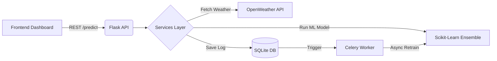

# AI-Based Road Accident Severity Prediction 🚗⚠️


A production-grade, end-to-end Machine Learning pipeline and web application designed to predict road accident severity based on real-time environmental factors. Built with **Flask**, **Scikit-Learn**, **Docker**, and asynchronously retrained via **Celery & Redis**.

---

## ✨ Features

- **Real-Time Predictions**: Instantly predict accident risk (0-100%) based on user inputs.
- **Automated Weather Integration**: Automatically fetches real-time weather data for the specified city using **OpenWeather**, seamlessly falling back to **Open-Meteo**.
- **Model Explainability (SHAP)**: Provides human-readable explanations of which factors contributed most to the current risk score.
- **Asynchronous ML-Ops Retraining**: Utilizing a **Celery Worker** and **Redis**, the system periodically retrains the ensemble model in the background as new prediction records are acquired.
- **Live Event Streaming**: Uses **Socket.IO** to broadcast new severe conditions or predictions instantly across connected dashboards.
- **Production-Ready Containerization**: Deploys rapidly via a minimal-footprint, multi-stage Docker build running under a secure non-root user constraint.
- **API Metrics**: Exposes a `/metrics` endpoint formatted for **Prometheus** monitoring aggregation.
- **Client-Side Voice Alerts**: Issues auditory warnings through the Web Speech API when detected risks breach critical thresholds (>=85%).

---

## 🏗️ Architecture



## 🚀 Quick Start (Docker)

The fastest and most robust way to run the application is via Docker Compose.

1. **Clone the repository:**
   ```bash
   git clone https://github.com/yourusername/Road_Accident_severity_AI.git
   cd Road_Accident_severity_AI
   ```
2. **Setup Environment:**
   Create a `.env` file in the root directory:
   ```env
   OPENWEATHER_API_KEY=your_api_key_here
   ```
   *(If omitted, it will gracefully fallback to Open-Meteo where possible).*

3. **Deploy:**
   ```bash
   docker-compose up --build -d
   ```
   The application will be universally available at [http://localhost:5000](http://localhost:5000).

---

## 💻 Local Development Setup

If you prefer to run it without Docker:

1. **Initialize Virtual Environment:**
   ```bash
   python -m venv venv
   source venv/bin/activate  # On Windows: venv\Scripts\activate
   ```
2. **Install Dependencies:**
   ```bash
   pip install -r requirements-dev.txt
   ```
3. **Train the Initial Model:**
   ```bash
   python train_model.py
   ```
4. **Boot the Server:**
   ```bash
   python app.py
   ```

*(Note: For the automated Celery retraining to function locally, you will need a running Redis instance on port `6379`).*

---

## 🧪 Testing
The repository employs `pytest` for comprehensive API integration testing. Mocks are utilized to simulate external weather APIs.
```bash
pytest test_app.py -v
```

---

## 📜 License
This project is licensed under the MIT License - see the [LICENSE](LICENSE) file for details.
